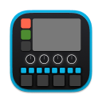

<p align="center">
  
</p>

<h1 align="center">Continuous Looper</h1>
<p align="center">
    <strong>live-looper and performance sampler</strong>
    <strong> [VIDEO DEMO](https://youtu.be/PcXRXFE9_So)</strong>
</p>

* 8 track looper
* Step sequence recorded loops
* Automatic slicing based on transient detection
* Parameter lock into step parameters
* Scene support
* Multiple quantization modes
* Easy, click and twist MIDI mapping


## Building
This app requires `looper-processor` universal C library bindings to be built:
```
cd ./crates/apps/looper/looper-processor
make
```

Then the app should be able to build.

## Parsing test results
```
brew install chargepoint/xcparse/xcparse
```

## License
This sub-directory is licensed under the AGPLv3 license.
