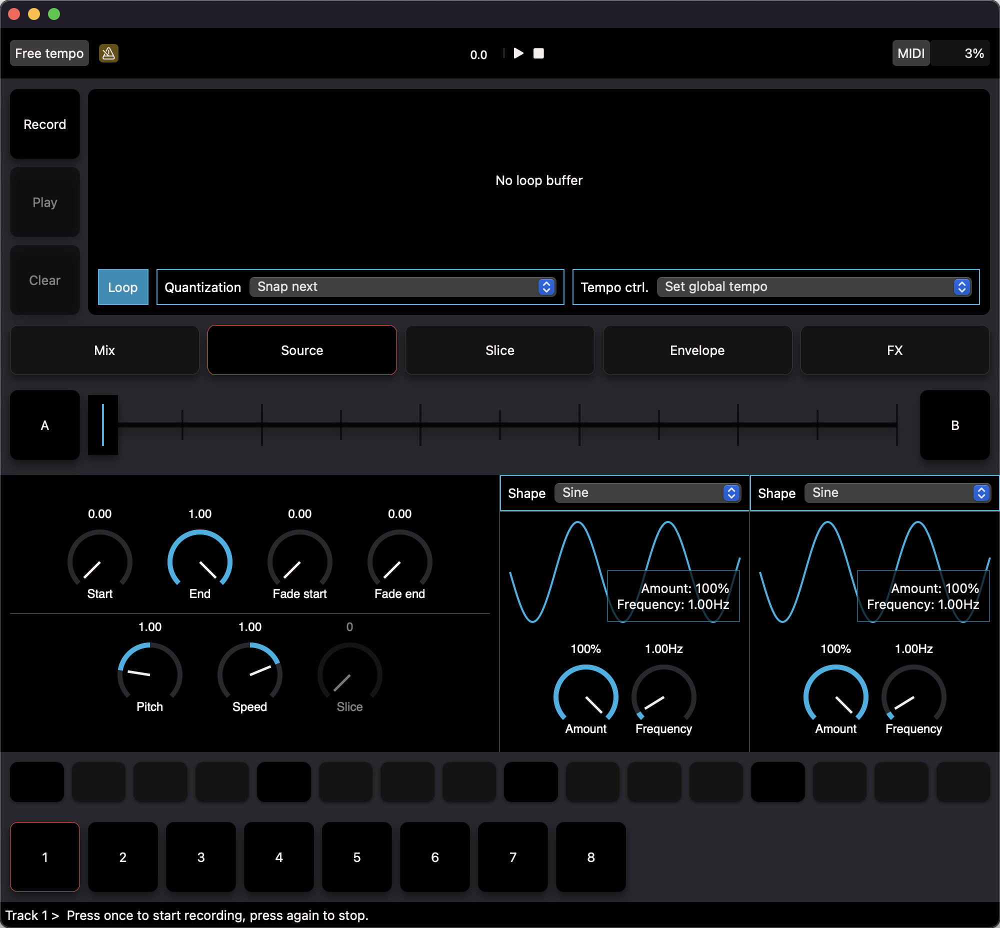

# Sequencer
**a live-looper and performance sampler.**

* 8 track looper
* Step sequence recorded loops
* Automatic slicing based on transient detection
* Parameter lock into step parameters
* Scene support
* Multiple quantization modes
* Easy, click and twist MIDI mapping



## Parsing test results
```
brew install chargepoint/xcparse/xcparse
```

## License
This sub-directory is licensed under the AGPLv3 license.
