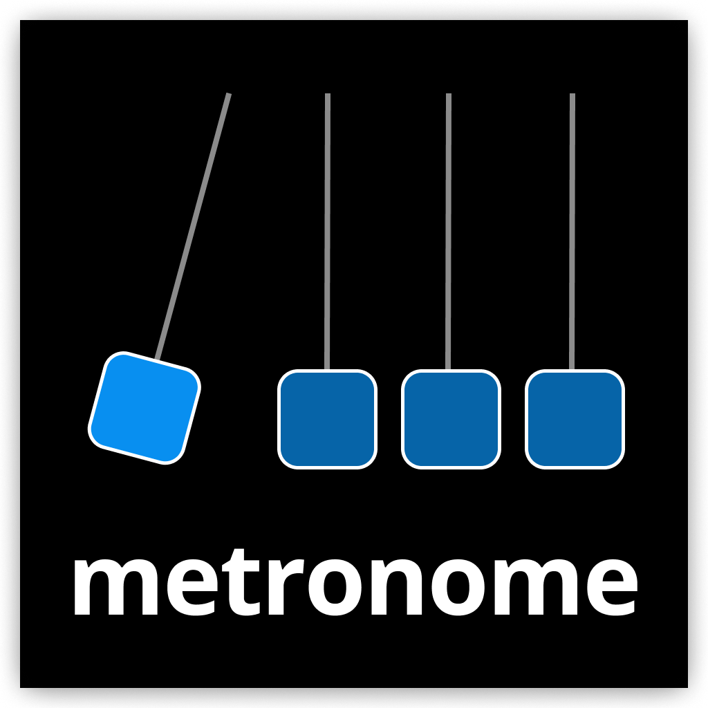

<p align="center">
  
</p>

# Simple Metronome

This is a tiny metronome app, meant to exercise `augmented-audio` libraries a bit.

You can read about it on: https://beijaflor.io/blog/01-2022/rust-audio-experiments-3/

And you can download it from the app store on [Simple Metronome](https://apps.apple.com/au/app/simple-metronome/id1604183938?mt=12).

<p align="center">
  
</p>

<p align="center" style="display: flex;">
  
  
</p>

## Building
**Simple Metronome** requires codegen of rust, C headers and dart code to work. To build it, run:

```
make
flutter build
```

> If on a M1 mac, you will need x86 homebrew and LLVM installed, since flutter
> tooling will only run via rosetta. See - https://stackoverflow.com/questions/67386941/using-x86-libraries-and-openmp-on-macos-arm64-architecture.

### Development builds
The dev-loop is as follows:

* If making changes to the dart/flutter side
  * Open the `metronome` folder in VSCode or Idea with the flutter extension
  * Run `flutter run` or use the IDE to start the app in debug mode
  * Run dart codegen whenever ORM or MobX models change
    * To run once `flutter pub run build_runner build --delete-conflicting-outputs`
    * To watch for changes `flutter pub run build_runner watch --delete-conflicting-outputs`
  * Commit the generated files, they are suffixed with `*.g.dart`
* If making changes to the Rust side
  * Run `make` whenever the rust code changes
  * Build/run flutter app as normal

### Tests
* Run `flutter test` to run dart tests
* Run `cargo test` to run rust tests, they likely exist in external crates instead of this one

## Architecture
[](https://mermaid.live/edit#pako:eNpNkMFqwzAMhl9F6NRC8wI5DDKylkEP29Jb0oOJ1cY0sYIsF0rTd5_TpTAdfoT5_l-y7tiyJczxLGbs4FA2HlJt620fVUngJOw1I2-PkGVv06e_8oXCBD8x6GqW9Z-j-t7XqyROCcr39XHJeZoqZSEw3oKQiqMrAfm5STnJ8h_94qCJNP1NXRumXbHaMZ97guL1tsybR88OmArlwbXAI4lRxz5MRbSO66fCoRMyNq2DGxxIBuNs-u19DmlQOxqowTy11silwcY_EhdHa5Q-rEt7Y34yfaANmqhc3XyLuUqkF1Q6ky43LNTjF4tqcOE)

### Tech-stack

[Flutter](https://flutter.dev/) is used for the UI, with [MobX](https://pub.dev/packages/mobx) for state management and
[Floor](https://pub.dev/packages/floor) for persistence.

[Flutter](https://flutter.dev/) is a high-level framework for building cross-platform apps using
[Dart](https://dart.dev/). Apps are built using a declarative UI pattern and implement a flexbox style layout system.
Internally, the framework will use a custom [`skia`](https://skia.org/) renderer to draw the UI. To interface with
platform APIs a message passing approach is used. Flutter code will use a single message passing API to interface with
multiple [platform-specific plug-ins](https://docs.flutter.dev/development/packages-and-plugins/developing-packages).

The `flutter` code runs on a single UI thread.

We don't require any significant plug-ins that weren't available for install from the `pub.dev` registry.

[MobX](https://pub.dev/packages/mobx) is used for state-management. It's based on reactive objects, observers and
computed properties.

[Rust](https://www.rust-lang.org) is used for audio-thread code. An audio-thread is started when the app boots and a
shared pointer to atomic state is used to communicate between the flutter UI and the audio-thread. When data to be
queried / mutated is small we use [atomics](https://doc.rust-lang.org/std/sync/atomic/). When data is larger we use
one of two other strategies: message-queues or immutable data atomic pointer swaps.

* **UI**
  * [Flutter](https://flutter.dev/)
  * [Dart](https://dart.dev/)
  * [MobX](https://pub.dev/packages/mobx)
  * [Floor](https://pub.dev/packages/floor)
  * [flutter_rust_bridge](https://github.com/fzyzcjy/flutter_rust_bridge)
* **Audio**
  * [Rust](https://www.rust-lang.org/)
  * [augmented-audio](https://github.com/yamadapc/augmented-audio)
  * [cpal](https://github.com/RustAudio/cpal/)

### Project structure

* `lib` - Flutter app
  * `lib/bridge_generated.dart` - Generated `dart` code using `rust_flutter_bridge` to call Rust code, calls into the native
    C API using FFI
  * `src/bridge_generated.rs` - Generated `rust` code using `rust_flutter_bridge`, exposes a C API for dart to call
  * `src/api.rs` - High-level API exposing bindings from `rust`
* `src` - Rust audio-processing
  * `src/api/*.rs` - Expose state management and audio wrapper for dart to call into
  * `audio-processor-traits` - Library for declaring audio processors
  * `audio-processor-metronome` - Library for metronome code
  * `audio-garbage-collector` - Reference counting GC strategy for real-time audio
  * `audio-processor-standalone` - Wrapper for audio processors using `cpal` to support cross-platform audio, as well
    as supporting offline rendering and plug-ins

### Flutter architecture

* `lib/ui` - Views
* `lib/modules/*` - Business logic
  * DB handling
  * State management and synchronization with rust back-end

State management is done using dart `mobx`. SQL is handled using `sqflite` and the `floor` ORM.

Both `mobx`, `floor` and the rust to dart require code-gen processes to be ran.

## Building for android

* Make sure Android SDK/Android Studio is set-up
* Set `ANDROID_HOME` environment variable to point to the Android SDK and `NDK_HOME` to point to the NDK
* Install `cargo-ndk` using `cargo install cargo-ndk`
* Make sure the `ANDROID_NDK` gradle property is set on `~/.gradle/gradle.properties`

## License
This subdirectory is licensed under AGPLv3 for now.
