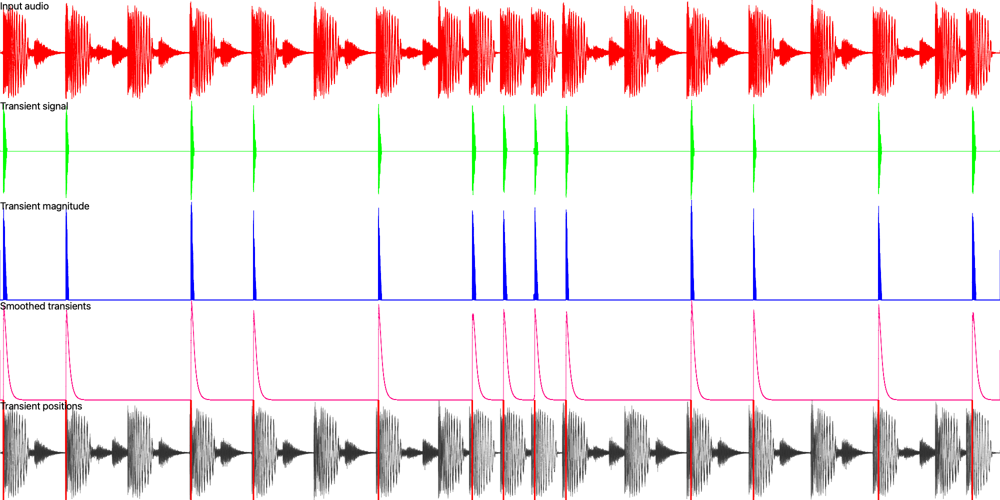

# audio-processor-analysis

Provides implementations of some audio analysis processors.

* **RMS**
* **Peak detector**
* **FFT (Windowed/Overlapped)**
* **Transient detection** (not real-time)

## RMS
Real-time safe, per-sample (ticked by UI thread) RMS calculation.

## Peak detector
Peak detector with adjustable attack/release times.

## FFT
`rustfft` audio-processor, forwards or backwards, real-time safe, FFT.

Applies a hann window.

Then performs FFT with N bins.

Overlap is configurable

## Envelope follower

Envelope follower implementation with adjustable attack/release times.

## Transient detection

Implements "[A Transient Detection Algorithm for Audio Using Iterative Analysis of STFT.
](https://www.researchgate.net/profile/Balaji-Thoshkahna/publication/220723752_A_Transient_Detection_Algorithm_for_Audio_Using_Iterative_Analysis_of_STFT/links/0deec52e6331412aed000000/A-Transient-Detection-Algorithm-for-Audio-Using-Iterative-Analysis-of-STFT.pdf)".

Does polyphonic transient detection, able to output signal or markers

